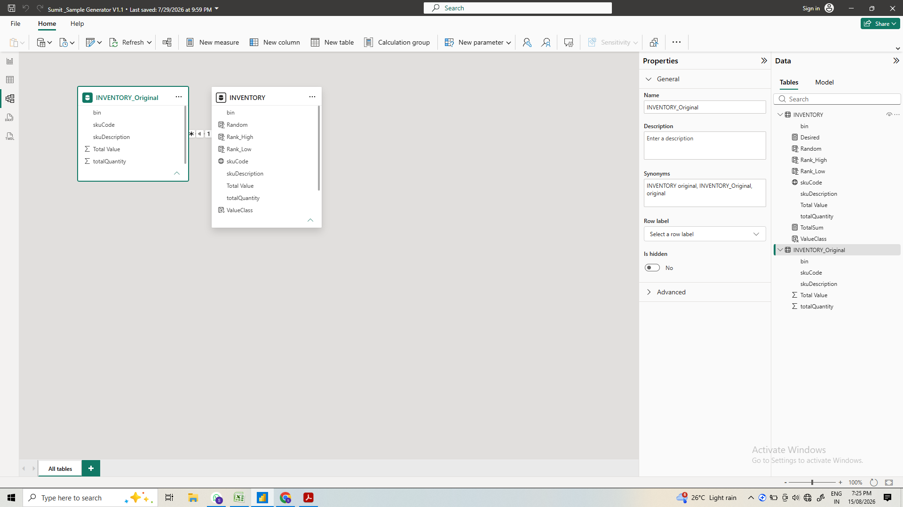
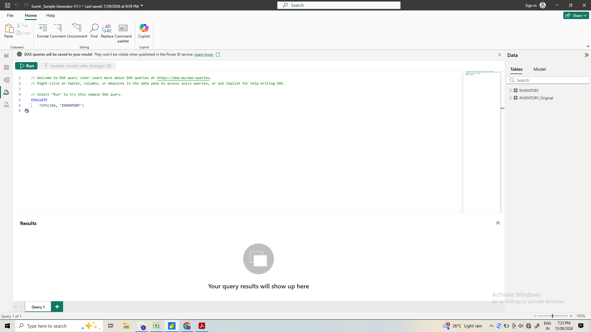
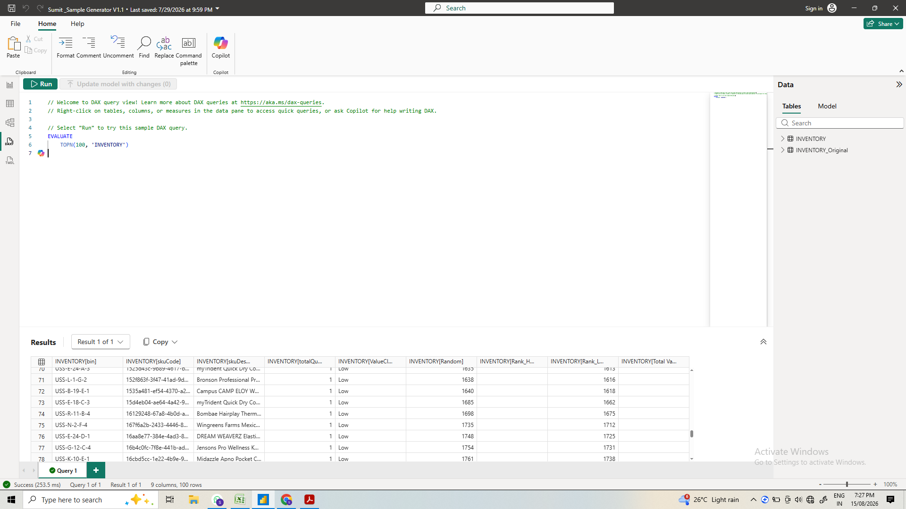

# 📦 Quick-Commerce Inventory Sampling & Audit System (Power BI)

An automated **Inventory Sampling and Physical Audit Generator** built in Power BI Desktop to streamline cycle counting, eliminate manual audit bias, and deliver stratified random sampling for 20,000+ warehouse SKUs.

---

## ⚙️ 1. Data Modeling & Architecture
Normalized one-to-many relationship connecting baseline inventory (`INVENTORY_Original`) with the operational sampling engine (`INVENTORY`).



---

## 🧮 2. DAX Query View & Performance Testing
Custom DAX ranking, randomized sampling logic (`Rank_High`, `Rank_Low`), and `TOPN` evaluation queries used to validate sample subsets before deployment.




```dax
// Sample DAX Verification Query
EVALUATE
TOPN(100, 'INVENTORY')
